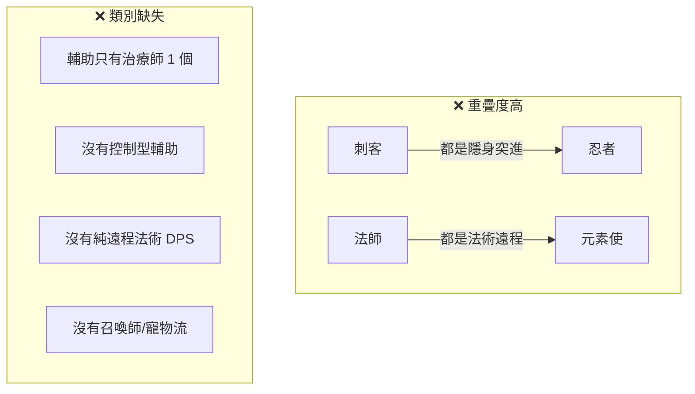
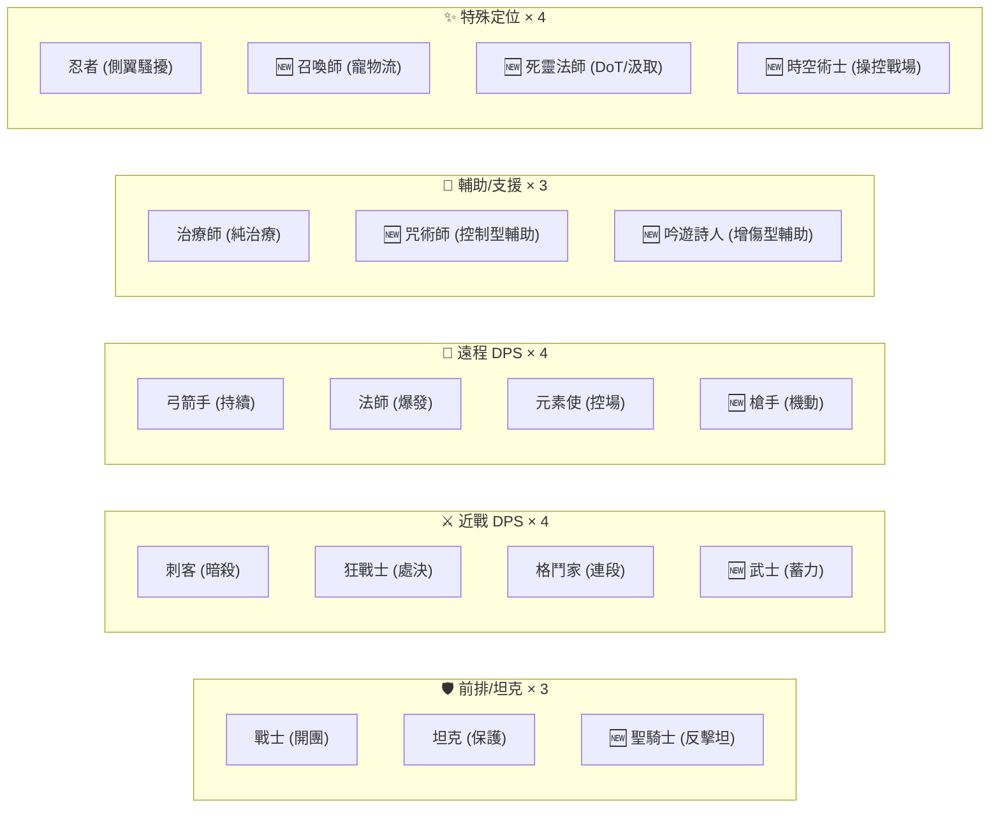

# 角色分類與擴充計畫：10 → 18 角色

## 現有角色分類分析

### 現有 10 角色歸類

| 大分類 | 子分類 | 角色 | Role 標籤 | 核心特色 |
|--------|--------|------|-----------|----------|
| **前排/坦克** | 開團型 | 🔴 戰士 (id:0) | 前排·開團/保護 | 突刺開團、鉤索拉人、大招護盾震懾 |
| | 保護型 | ⚪ 坦克 (id:3) | 前排·保護/擾亂 | 護盾分享、擒抱聚怪、減傷光環 |
| **近戰 DPS** | 刺殺型 | 🟣 刺客 (id:2) | 突進·單體爆發 | 隱身→標記→引爆，背刺加傷 |
| | 刺殺型 | ⚫ 忍者 (id:7) | 機動·騷擾/控制 | 影縛定身、瞬移、煙影隱身 |
| | 狂暴型 | 🔴 狂戰士 (id:6) | 突進·處決鬥士 | 自損換傷、殘血增幅、斬殺 |
| | 格鬥型 | 🟡 格鬥家 (id:9) | 近戰·連段決鬥 | 連擊氣勢、招架反彈、萬用 |
| **遠程 DPS** | 爆發法師 | 🔵 法師 (id:1) | 後排·遠程爆發 | 冰矛→凍結→烈焰吐息/流星 |
| | 控場法師 | 🟠 元素使 (id:8) | 控制·區域封鎖 | 火牆封路、凍徑風箏、持續燃燒 |
| | 物理射手 | 🟢 弓箭手 (id:4) | 後排·持續輸出 | 越遠越痛、貫穿箭、寄生箭 |
| **輔助** | 治療型 | ⚪ 治療師 (id:5) | 支援·團隊核心 | 團隊回血、聖光環、大招逆轉 |

---

### 角色相似度與問題分析

**核心問題：**
1. **刺客 vs 忍者**：都是隱身 + blink 突進型，定位重疊 → 忍者偏「控制/騷擾」但體感仍像刺客
2. **法師 vs 元素使**：都是法系遠程 → 法師偏爆發、元素使偏控場，但可再分化
3. **輔助**：只有治療師，缺少「控制型輔助」與「增傷型輔助」
4. **遠程物理**：只有弓箭手 → 缺少不同風格的射手
5. **沒有召喚/寵物類**角色

---

## 角色擴充方案

### 新分類體系 (18 角色)

---

## 8 個新角色詳細設計

### 🆕 角色 10：聖騎士 (Paladin) — 前排·反擊坦

> **定位**：以反擊和淨化為核心的信仰系坦克，和坦克的「保護」不同，聖騎士擅長「懲罰攻擊自己的敵人」。

| 屬性 | 數值 | 說明 |
|------|------|------|
| HP | 380 | 高血量但略低於坦克 |
| Mana | 80 | 中等 |
| Speed | 138 | 慢速前排 |
| Color | `#daa520` (金色) | |

**天賦：聖光懲戒** — 受到傷害時，以受傷量 15% 回擊對方（類似 reflect，但被動觸發、不需開盾）

| 技能 | 名稱 | Type | 核心機制 |
|------|------|------|----------|
| Basic | 聖槌 | melee | 低傷、中擊退，附帶短暫減速 |
| Skill1 | 神聖衝鋒 | charge | 衝向敵人，命中後暈眩 0.8 秒，同時自身獲得護盾 |
| Skill2 | 制裁之光 | zone (range:0) | 以自身為圓心釋放聖光，對敵方造成傷害並淨化友方 debuff，對友方附加短暫護盾 |
| Ultimate | 天堂審判 | zone | 在目標區域召喚巨大光柱，持續傷害 + 減速敵人，並讓區域內友方持續回血；自身獲得大量護盾 + 反傷 |

---

### 🆕 角色 11：咒術師 (Hexer) — 輔助·控制型

> **定位**：以 debuff 和控場為主的控制型輔助，傷害普通，但能大幅削弱敵方戰鬥力。

| 屬性 | 數值 | 說明 |
|------|------|------|
| HP | 210 | 偏脆 |
| Mana | 130 | 高魔量 |
| Speed | 165 | 中速 |
| Color | `#8e44ad` (深紫) | |

**天賦：詛咒擴散** — 當帶有 debuff 的敵人死亡時，該 debuff 傳染給周圍 200 範圍內的其他敵人。

| 技能 | 名稱 | Type | 核心機制 |
|------|------|------|----------|
| Basic | 詛咒彈 | projectile | 低傷，但命中後附加「弱化」效果（受傷增加 15%，持續 3 秒） |
| Skill1 | 噩夢束縛 | projectile | 命中後 root 1.5 秒 + slow 3 秒，低傷害 |
| Skill2 | 衰弱領域 | zone (follow) | 跟隨自身的光環，圈內敵方持續減速 + 減傷輸出（-25% dmg debuff），圈內友方加速 |
| Ultimate | 萬咒齊發 | zone | 大範圍瞬發，圈內所有敵人獲得 root + slow + 受傷增加 效果，持續 3 秒；友方獲得 cleanse + 護盾 |

> [!IMPORTANT]
> 需要新增 `weaken` effect kind（受傷增加），以及 `dmg_reduce` effect kind（降低攻擊輸出）。這兩個新效果需要在 [entities.js](file:///Users/curtliu/Desktop/ai-project/fighting_game/src/game/entities.js) 的 `applyEffect` 和 [simulation.js](file:///Users/curtliu/Desktop/ai-project/fighting_game/src/game/simulation.js) 的 `dealDamage` 中實作。

---

### 🆕 角色 12：吟遊詩人 (Bard) — 輔助·增傷型

> **定位**：透過 buff 增幅全隊戰力的進攻型輔助。不像治療師提供回血，而是提供攻速、移速、增傷。

| 屬性 | 數值 | 說明 |
|------|------|------|
| HP | 190 | 脆皮 |
| Mana | 120 | 較高 |
| Speed | 182 | 中快速 |
| Color | `#e91e63` (品紅/玫瑰) | |

**天賦：戰歌共鳴** — 周圍 250 範圍內每多一名友方，自身和友方額外 +5% 傷害（最多 3 層 = +15%）。

| 技能 | 名稱 | Type | 核心機制 |
|------|------|------|----------|
| Basic | 音波衝擊 | projectile | 中低傷，附帶微量擊退，飛行速度快 |
| Skill1 | 激昂戰歌 | buff | 對友方施加 `rage`：+30% 傷害 + +15% 攻速，持續 6 秒 |
| Skill2 | 不諧和音 | projectile (pierce) | 音波貫穿，命中敵人造成中傷 + stun 0.5 秒 |
| Ultimate | 英雄頌歌 | buff + zone | 以自身為中心釋放光環，友方獲得 haste + rage + 護盾 + cleanse；敵方受 slow + 中傷 |

---

### 🆕 角色 13：武士 (Samurai) — 近戰·蓄力精準

> **定位**：高風險高回報的蓄力型近戰。等待時機、精準出刀，一擊致命。和格鬥家的「連段」、狂戰士的「狂暴」形成鮮明對比——武士講究的是「一擊斃命」。

| 屬性 | 數值 | 說明 |
|------|------|------|
| HP | 240 | 中等 |
| Mana | 60 | 偏低，靠基本攻擊 |
| Speed | 192 | 中快 |
| Color | `#c0392b` (深紅/緋紅) | |

**天賦：居合之道** — 持續未攻擊 2 秒後，下一次攻擊傷害 +80%，並附帶短暫的移速提升。

| 技能 | 名稱 | Type | 核心機制 |
|------|------|------|----------|
| Basic | 拔刀斬 | melee | 中高傷、中距離弧線斬。冷卻比一般基本攻擊略長 (0.7s) 但單下傷害高 |
| Skill1 | 居合·閃 | dash | 超高速短距衝刺斬，傷害高，附帶 bleed。若從天賦加持狀態發出，範圍和傷害翻倍 |
| Skill2 | 刀背擋 | buff | 短暫格擋（1.5 秒），期間獲得護盾 + reflect。格擋結束時對前方扇形自動反擊一刀 |
| Ultimate | 一閃·千刀流 | multiblink | 對最近 3 個敵人進行連續居合斬，每刀附 bleed，最後一刀附帶 stun |

---

### 🆕 角色 14：槍手 (Gunslinger) — 遠程·機動射手

> **定位**：高機動性的雙槍射手，和弓箭手的「定點遠距」不同，槍手擅長中距離跑打、翻滾閃避。

| 屬性 | 數值 | 說明 |
|------|------|------|
| HP | 200 | 偏低 |
| Mana | 70 | 中等 |
| Speed | 210 | 快速 |
| Color | `#f39c12` (琥珀橘) | |

**天賦：火力壓制** — 連續命中同一個目標時，每命中一次增加 +8% 傷害（最多 5 層），切換目標時重置。

| 技能 | 名稱 | Type | 核心機制 |
|------|------|------|----------|
| Basic | 雙槍射擊 | projectile | 同時發射 2 發子彈（count:2, spread 小），單發低傷但射速極快（cd: 0.28） |
| Skill1 | 翻滾閃避 | blink | 短距離 blink（range: 180），位移後 1 秒內基本攻擊 +40% 傷害、+50% 攻速 |
| Skill2 | 燃燒彈 | projectile | 爆發性單發高傷，命中後附帶 burn + 小範圍 AOE（hitRadius） |
| Ultimate | 彈幕風暴 | projectile (count:12) | 朝面前扇形傾瀉 12 發高速子彈，每發附帶擊退，越近傷害越高（反向 deadeye） |

> [!NOTE]  
> 槍手與弓箭手的差異化：弓箭手越遠越強、慢節奏、高單發；槍手越近越強、快節奏、多發。
> 
> 另外，槍手的 color `#f39c12` 與元素使 `#e67e22` 接近，可以在實作時調整為更偏黃的 `#f1c40f` 或更偏棕的 `#d4a017`，但要注意不要和格鬥家 `#f1c40f` 撞色。建議用 `#d4a017`。

---

### 🆕 角色 15：召喚師 (Summoner) — 特殊·寵物流

> **定位**：操控召喚物的獨特角色。自身戰力低，但透過召喚生物建立數量優勢。

| 屬性 | 數值 | 說明 |
|------|------|------|
| HP | 210 | 偏低 |
| Mana | 130 | 高魔 |
| Speed | 155 | 偏慢 |
| Color | `#16a085` (深青綠) | |

**天賦：召喚共鏈** — 召喚物存活時，每隻給自身 +10% 受傷減免（最多 3 隻 = 30%）+ 召喚物命中敵人時回復召喚師 5 HP。

| 技能 | 名稱 | Type | 核心機制 |
|------|------|------|----------|
| Basic | 靈魂碎片 | projectile | 極低傷、慢速追蹤彈（homing），自身打點只為充能 |
| Skill1 | 召喚戰靈 | summon | 召喚 1 隻格鬥型小怪（基於 AI `minion`），會主動追擊最近敵人 |
| Skill2 | 靈魂爆破 | zone (self) | 犧牲所有存活召喚物，每隻在原地爆炸造成 AOE 傷害 + stun 0.6s |
| Ultimate | 大召喚術 | summon | 一次召喚 3 隻強化戰靈 + 自身獲得護盾 + haste |

> [!IMPORTANT]
> 需要為普通玩家增加 `summon` action type 的支援。目前只有魔王模式的 `summon_clones` 和 `summon_minions`，需要複用 [simulation.js](file:///Users/curtliu/Desktop/ai-project/fighting_game/src/game/simulation.js) 中的 `bossSummonMinions` 邏輯，改寫為通用版本。召喚物使用 `aiId: 'minion'` 的 AI 行為，已在 [bossAI.js](file:///Users/curtliu/Desktop/ai-project/fighting_game/src/game/bossAI.js) 中實作。

---

### 🆕 角色 16：死靈法師 (Necromancer) — 特殊·DoT/汲取

> **定位**：以 HP 換取強力 DoT 和汲取的暗系法師。和法師的「瞬間爆發」不同，死靈法師是「持續壓血」。

| 屬性 | 數值 | 說明 |
|------|------|------|
| HP | 230 | 中等 |
| Mana | 110 | 中高 |
| Speed | 155 | 偏慢 |
| Color | `#2d3436` (暗灰黑) | |

**天賦：亡者之觸** — 對敵人造成的 DoT（burn/bleed）每跳同時回復自身等量 40% 的生命值。

| 技能 | 名稱 | Type | 核心機制 |
|------|------|------|----------|
| Basic | 死亡射線 | projectile | 低傷，附帶 bleed (3 秒) |
| Skill1 | 生命汲取 | channel | 持續鎖定最近敵人，每秒造成傷害並等量回復自身 HP |
| Skill2 | 腐蝕爆發 | zone | 在目標區域釋放毒霧，持續 4 秒，每跳造成傷害 + bleed |
| Ultimate | 亡靈大軍 | summon + buff | 在自身周圍召喚 2 隻亡靈小兵 + 釋放大範圍 debuff zone（slow + bleed），自身獲得護盾 + lifesteal |

---

### 🆕 角色 17：時空術士 (Chronomancer) — 特殊·操控戰場

> **定位**：操控時間與空間的高技巧角色。透過加速友方、減速敵方、回溯位置來操控戰場節奏。

| 屬性 | 數值 | 說明 |
|------|------|------|
| HP | 180 | 脆皮 |
| Mana | 140 | 極高 |
| Speed | 175 | 中速 |
| Color | `#00bcd4` (青藍) | |

**天賦：時間稜鏡** — 每次施放技能後，獲得 1.5 秒的 haste (+25% 移速)，讓時空術士可以施法後快速重新走位。

| 技能 | 名稱 | Type | 核心機制 |
|------|------|------|----------|
| Basic | 時空裂隙 | projectile | 低傷，命中後 slow 1.5 秒 |
| Skill1 | 時間加速 | buff (ally) | 對範圍內友方施加 haste (+40% 移速) + rage (+20% 傷害) 持續 5 秒 |
| Skill2 | 時間停滯 | zone | 在目標區域建立時停場，圈內敵人 stun 1.2 秒 + slow 2 秒 |
| Ultimate | 時空逆轉 | buff + zone | 將自身回溯到 3 秒前的位置和血量（取較高 HP），同時對當前位置釋放大範圍爆炸（stun + 傷害），並給友方全體 cleanse + 護盾 |

> [!NOTE]
> 時空逆轉大招需要追蹤玩家歷史位置和 HP。目前 boss 模式已有 `_hist` 欄位追蹤位置（見 `bossTimeRewind`），可以復用並增加 HP 記錄。

---

## 最終角色總覽 (18 角色)

| ID | 名稱 | 大分類 | 子分類 | 定位標籤 | 狀態 |
|----|------|--------|--------|----------|------|
| 0 | 戰士 | 前排/坦克 | 開團型 | 前排·開團/保護 | ✅ 現有 |
| 1 | 法師 | 遠程 DPS | 爆發法師 | 後排·遠程爆發 | ✅ 現有 |
| 2 | 刺客 | 近戰 DPS | 暗殺型 | 突進·單體爆發 | ✅ 現有 |
| 3 | 坦克 | 前排/坦克 | 保護型 | 前排·保護/擾亂 | ✅ 現有 |
| 4 | 弓箭手 | 遠程 DPS | 持續射手 | 後排·持續輸出 | ✅ 現有 |
| 5 | 治療師 | 輔助 | 純治療 | 支援·團隊核心 | ✅ 現有 |
| 6 | 狂戰士 | 近戰 DPS | 狂暴型 | 突進·處決鬥士 | ✅ 現有 |
| 7 | 忍者 | 特殊 | 側翼騷擾 | 機動·騷擾/控制 | ✅ 現有 |
| 8 | 元素使 | 遠程 DPS | 控場法師 | 控制·區域封鎖 | ✅ 現有 |
| 9 | 格鬥家 | 近戰 DPS | 連段型 | 近戰·連段決鬥 | ✅ 現有 |
| 10 | 聖騎士 | 前排/坦克 | 反擊型 | 前排·反擊/淨化 | 🆕 新增 |
| 11 | 咒術師 | 輔助 | 控制輔助 | 支援·控制削弱 | 🆕 新增 |
| 12 | 吟遊詩人 | 輔助 | 增傷輔助 | 支援·增傷加速 | 🆕 新增 |
| 13 | 武士 | 近戰 DPS | 蓄力型 | 近戰·蓄力一擊 | 🆕 新增 |
| 14 | 槍手 | 遠程 DPS | 機動射手 | 後排·機動跑打 | 🆕 新增 |
| 15 | 召喚師 | 特殊 | 寵物流 | 特殊·召喚操控 | 🆕 新增 |
| 16 | 死靈法師 | 特殊 | DoT/汲取 | 特殊·持續壓血 | 🆕 新增 |
| 17 | 時空術士 | 特殊 | 時空操控 | 特殊·戰場操控 | 🆕 新增 |

---

## User Review Required

> [!IMPORTANT]
> **角色數量與選擇**：目前提案 8 個新角色（10 → 18）。若覺得太多，可以選擇只先做 6 個（到 16 個），以下是建議優先順序：
> 1. **咒術師** — 填補輔助的重大空缺（控制型）
> 2. **吟遊詩人** — 填補輔助的增傷缺口
> 3. **聖騎士** — 補充前排第三選擇
> 4. **武士** — 近戰新玩法（蓄力型）
> 5. **槍手** — 遠程射手差異化
> 6. **召喚師** — 全新玩法（寵物流）
> 7. **死靈法師** — DoT 特化
> 8. **時空術士** — 最複雜的操控型

> [!WARNING]
> **新機制需求**：部分角色需要新增遊戲機制：
> - **咒術師**：`weaken`（受傷增加）、`dmg_reduce`（降低攻擊力）兩個新 effect
> - **召喚師 & 死靈法師**：普通角色使用 `summon` type（目前只有 boss 可以召喚）
> - **時空術士**：玩家位置/HP 歷史追蹤（復用 boss 模式的 `_hist`）
> - **武士天賦**：「未攻擊計時器」新被動機制
> - **槍手天賦**：「針對同一目標累計」的追蹤機制

## Open Questions

1. **你希望先做哪幾個角色？** 全部 8 個一起做，還是分批？ANS: 一起
2. **角色排列順序（ID）有偏好嗎？** 目前是依照 10~17 按分類排列。ANS: 可以
3. **忍者要保持現狀？** 還是希望趁機重新調整忍者定位（更偏控制而非刺客），進一步和刺客分化？可以，尤其是隱身很沒有用，處理一下
4. **是否需要同步更新角色選擇 UI**（如添加分類篩選標籤）？需要
5. **是否有你特別想要的角色風格或技能組？** 例如你提到的「輔助以控制為主」已經有咒術師方案，還有什麼想法？目前沒有

---

## Proposed Changes

### Core Game Logic

#### [MODIFY] [characters.js](file:///Users/curtliu/Desktop/ai-project/fighting_game/src/game/characters.js)
- 新增 8 個角色定義（id 10~17），包含完整的 stats、talent、basic、skill1、skill2、ultimate
- 為每個新角色新增 `generateTextureSprite` 紋理圖案分支

#### [MODIFY] [entities.js](file:///Users/curtliu/Desktop/ai-project/fighting_game/src/game/entities.js)
- `applyEffect` 新增 `weaken`（受傷增加）、`dmg_reduce`（降低輸出）兩種效果
- `dealDamage` 中加入 `weaken` 和 `dmg_reduce` 修正

#### [MODIFY] [simulation.js](file:///Users/curtliu/Desktop/ai-project/fighting_game/src/game/simulation.js)
- `executeAction` 新增 `summon` type（複用 `bossSummonMinions` 邏輯的通用版）
- 新增武士天賦「居合之道」的「未攻擊計時器」邏輯
- 新增槍手天賦「火力壓制」的「同目標連擊計數」邏輯
- 新增時空術士大招「時空逆轉」的位置/HP 回溯邏輯
- 新增召喚師天賦「召喚共鏈」的每幀被動檢查
- 新增死靈法師天賦「亡者之觸」的 DoT 回血邏輯
- 新增吟遊詩人天賦「戰歌共鳴」的友方計數增傷
- 新增咒術師天賦「詛咒擴散」的死亡時 debuff 傳染
- 新增時空術士天賦「時間稜鏡」的施法後 haste

---

### Rendering & UI

#### [MODIFY] [renderer.canvas2d.js](file:///Users/curtliu/Desktop/ai-project/fighting_game/src/game/renderer.canvas2d.js)
- 新增 `weaken` 和 `dmg_reduce` 效果的視覺表現

#### [MODIFY] 角色選擇畫面相關組件
- 確保 UI 支持顯示 18 個角色（可能需要調整布局或新增分類）

---

## Verification Plan

### Automated Tests
- 逐一測試每個新角色的技能：確認 cd、manaCost、傷害數值正確
- 驗證新 effect (weaken/dmg_reduce) 能正確影響 dealDamage
- 驗證 summon type 在非 boss 模式下正常運作

### Manual Verification
- 在訓練模式中逐一試玩 8 個新角色
- 確認紋理貼圖正確生成
- 確認角色選擇 UI 能正確顯示 18 個角色
- 確認新天賦被動效果正確觸發
